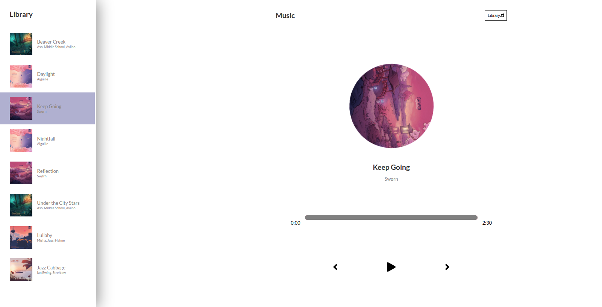

# Project Name: Music Player

### Project Description
A ReactJS music application to play slow and soothing music from a library while writing code.

### Setup Instructions
In the project directory, you can run:

### `npm start`

Runs the app in the development mode.\
Open [http://localhost:3000](http://localhost:3000) to view it in the browser.

The page will reload if you make edits.\
You will also see any lint errors in the console.

### `npm test`

Launches the test runner in the interactive watch mode.\
See the section about [running tests](https://facebook.github.io/create-react-app/docs/running-tests) for more information.

### `npm run build`

Builds the app for production to the `build` folder.\
It correctly bundles React in production mode and optimizes the build for the best performance.

The build is minified and the filenames include the hashes.\
Your app is ready to be deployed!

# BDD

## Input

Application has no input.

## Output

From the library list, a user can select from a static list of a music playlist and choose the song to play

# Contact Infomation:
### Author: [DENNIS NJENGA](https://github.com/deepeters)

         Email: dennis@dennis.com
         Phone: +254712345678

### Technology Used
1. ReactJS
2. HTML
3. SCSS
4. Javascript

### Frameworks Used
1. Git

### LICENSE: [MIT LICENSE](https://raw.githubusercontent.com/deepeters/music-player/master/LICENSE)
